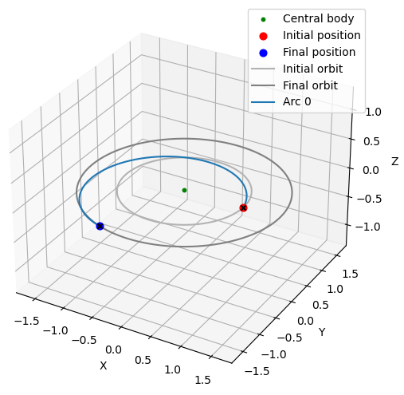
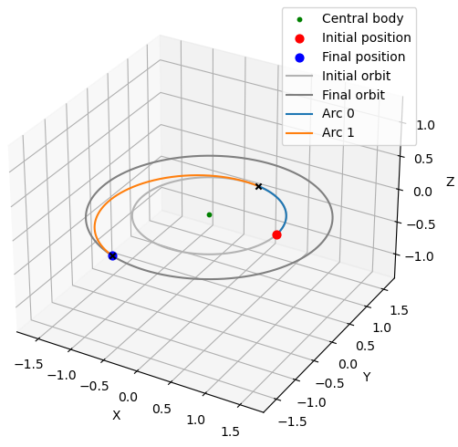

# py2iopt
A Python implementation of optimal two-impulse, time-fixed rendezvous maneuvers in accordance with Primer Vector Theory. A Lambert rendezvous maneuver is improved by the addition of an initial and/or final coasting phase. The trajectories are strictly keplerian (no perturbation) and the Lambert solver integrated in `py2iopt` does not allow for multi-revolution transfers. The optimization algorithm used in `py2iopt` is Ipopt [1].

### Dependencies

- `pykep`, `numpy`, `matplotilb`, `numba`, `pygmo`

### Basic usage
Examples on how to use `py2iopt` are included in `./examples/`. Example `1_` is a replication of Fig. 2.5 and Fig. 2.6 from Chapter 2 of "Spacecraft Trajectory Optimization" edited by B. A. Conway [2]. Examples `2_` to `5_` compute families of two-impulse rendezvous maneuvers for a variety of relative positions between the chaser and the target.

First start by importing the `py2iopt` and `pykep`.

```python
#import sys
#sys.path.append("../")  # make sure the pyrqlaw folder is exposed
import py2iopt
import pykep as pk
```

Define the central body's gravitational parameter, and lower and upper bounds of the time window:

```python
mu = 1
t0 = 0*(2*np.pi)
tf = 0.9*(2*np.pi)
```

Define the chaser's initial position and velocity vectors.

```python
rc0 = (1, 0, 0) # chaser's initial position
vc0 = (0, (mu/1)**.5, 0) # chaser's initial velocity
```

Define the target's initial position and velocity vectors, and propagate them from `t0` to `tf`.

```python
rt0 = (0, 1.6, 0) # target's initial position
vt0 = (-(mu/1.6)**.5, 0, 0) # target's initial velocity
rcf, vcf = pk.propagate_lagrangian(r0=rt0, v0=vt0, tof=tf-t0, mu=mu)
```

Initialize the `TwoImpulseRDV` class instance with the previously-defined inputs.

```python
tirdv = TwoImpulseRDV(mu=mu, verbosity=1)
tirdv.set_problem(t0, tf, rc0, rcf, vc0, vcf)
```

Solve the problem.

```python
tirdv.solve()
```

Finally, display the results and plot the rendezvous maneuvers with and without coasting phases.

```python
# Display results
tirdv.pretty_results(time_scale=2*np.pi)

# Plot trajectory and primer vector magnitude history
tirdv.plot(plot_optimal=False, time_scale=2*np.pi) # plot Lambert maneuver
tirdv.plot(plot_optimal=True, time_scale=2*np.pi) # plot solution with initial and/or final coasting
plt.show()
```

```
Exit code : 1
Coasting  : True
t1        : 0.2207
t2        : 0.9
deltaV    : 0.2146
```

<p align="center">
  
</p>
<p align="center">
<em>Example of a rendezvous maneuver without coasting phase (deltaV = 0.3747).</em>
</p>

<p align="center">
  
</p>
<p align="center">
<em>Example of a rendezvous maneuver with an initial coasting phase (deltaV = 0.2146).</em>
</p>


### Notes
- Since the Ipopt optimizer uses a gradient-descent algorithm, the solutions found by `py2iopt` are locally optimal.
- The literature on multi-impulse, time-fixed rendezvous maneuvers is vast. A few publications are highlighted in the reference section below. Ref. [3-5] set the foundations of Primer Vector Theory. Some publications explore more precise formulations of the impulsive rendezvous problem, whether it be in terms of the number of impulses to minimize the deltaV [6], the addition of path constraints [7], or maneuvers in perturbed dynamic environments (e.g, J2, third-body). Others explore new methods to find globally optimal rendezvous maneuvers [8-11].


### References

[1] [Ipopt](https://coin-or.github.io/Ipopt/) (Interior Point OPTimizer)

[2] Conway, B. A. (2010). Spacecraft Trajectory Optimization. Cambridge University Press.

[3] Lawden, D. F. (1963). Optimal Trajectories for Space Navigation. Butterworths.

[4] Lion, P. M., & Handelsman, M. (1968). Primer Vector on Fixed-Time Impulsive Trajectories. AIAA Journal, 6, No. 1, 127-132.

[5] Jezewski, J. J., & Rozendaal, H. L. (1968). An Efficient Method for Calculating Optimal Free-Space n-impulse Trajectories. AIAA Journal, 6, No. 11, 2160-2165.

[6] Prussing, J. E., & Chiu, J-H. (1986). Optimal Multiple-Impulse Time-Fixed Rendezvous between Circular Orbits. Journal of Guidance, Control, and Dynamics, 9, No. 1, 17-22.

[7] Taur, D-R., Coverstone, V., & Prussing, J. E. (1995) Optimal Impulsive Time-Fixed Orbital Rendezvous and Interception with path Constraints. Journal of Guidance, Control, and Dynamics, Vol. 18, No. 1.

[8] Kim, Y. H., & Spencer, D. B. (2002) Optimal Spacecraft Rendezvous Using Generatic Algorithms. Hournal of Spacecraft and Rockets, Vol. 39, No. 6.

[9] Luo, Y-Z., Zhang, J., Li, H-Y., & Tang, G-J. (2010) "Interactive Optimization Approach for Optimal Impulsive Rendezvous Using Primer Vector Theory and Evolutionary Algorithm. Acta Astronautica, 67, pp. 396-405.

[10] Shen, H-X., Casalino, L., & Luo, Y. Z. (2015) Global Search Capabilities of Indirect Methods for Impulsive Transfers. Journal of the Atsronautical Sceinces, Vol. 62, No. 3, pp. 212-232.

[11] Gong , M., Zhou, D., Shao, C., & Fang, Y. (2022) Optimal Multiple-Impulse Time-Fixed Rendezvous Using Evolutionary Algorithms. Journal of Spacecraft and Rockets, Vol. 59, No. 2.


